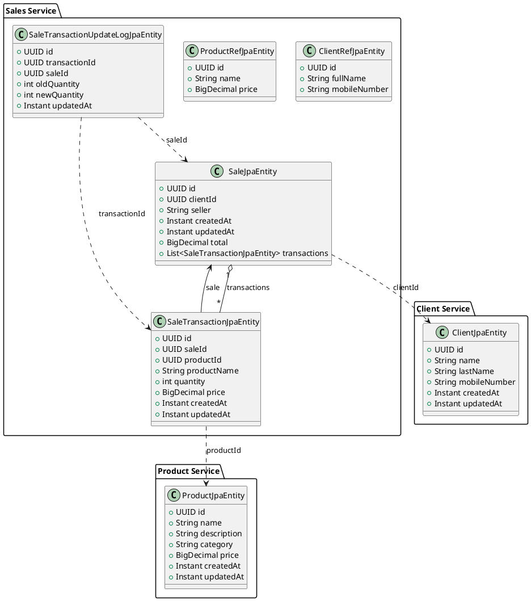

# Simple Sales System – API & Architecture Documentation

> **Version:** 1.0 · **Last updated:** 27 Jul 2025

---

## Table of Contents

- [Simple Sales System – API \& Architecture Documentation](#simple-sales-system--api--architecture-documentation)
    - [Table of Contents](#table-of-contents)
    - [System Overview](#system-overview)
    - [High-Level Architecture](#high-level-architecture)
    - [Service Catalogue](#service-catalogue)
    - [Synchronous REST APIs](#synchronous-rest-apis)
        - [API Gateway Route Table](#api-gateway-route-table)
        - [Client Service Endpoints](#client-service-endpoints)
        - [Product Service Endpoints](#product-service-endpoints)
        - [Sales Service Endpoints](#sales-service-endpoints)
    - [Asynchronous Events (Kafka / Avro)](#asynchronous-events-kafka--avro)
        - [Topic Naming Convention](#topic-naming-convention)
        - [Schema Registry](#schema-registry)
        - [Serialization Strategy](#serialization-strategy)
        - [Event Flow Example – Client Created](#event-flow-example--client-created)
    - [Data Persistence \& Migrations](#data-persistence--migrations)
    - [Domain \& Design Patterns](#domain--design-patterns)
        - [Domain-Driven Design (DDD)](#domain-driven-design-ddd)
        - [Kafka Integration with DDD](#kafka-integration-with-ddd)
        - [Hexagonal Architecture](#hexagonal-architecture)
        - [CQRS](#cqrs)
    - [Build \& Run](#build--run)
    - [Future Enhancements](#future-enhancements)

---

## System Overview

The **Simple Sales System** is a microservice application demonstrating an enterprise-grade architecture designed for a sales domain, employing:

- **Microservices:** `client-service`, `product-service`, `sales-service`, and `api-gateway`.
- **Event-Driven Architecture (EDA):** Kafka with Confluent Schema Registry using Avro payloads.
- **Domain-Driven Design (DDD)** with **Hexagonal Architecture** (Ports & Adapters).
- **CQRS:** Separate handlers for queries (reads) and commands (writes).
- **Liquibase:** Version-controlled database migrations per service.
- **Docker Compose:** For local orchestration of Kafka, PostgreSQL, and services.

---

## High-Level Architecture

```
[Client] ← REST → [API Gateway] ──→ [client-service]
                       ↘︎          └─→ [product-service]
                        ↘︎              └─→ [sales-service]

All services ↔ Kafka ↔ Schema Registry
```

- **API Gateway:** Handles routing, basic authentication, and API versioning.
- **Services:** Publish and consume Avro events on Kafka topics.
- **Databases:** PostgreSQL databases per service.

> **Tip:** Use Docker Compose for streamlined local development.

---

## Service Catalogue

| Service         | Port | DB Schema         | Responsibility                  |
| --------------- | ---- | ----------------- | ------------------------------- |
| api-gateway     | 8180 | —                 | Routing and aggregation         |
| client-service  | 8182 | `client_service`  | Client management               |
| product-service | 8181 | `product_service` | Product management              |
| sales-service   | 8183 | `sales_service`   | Sales transactions and auditing |

---

## Synchronous REST APIs

### API Gateway Route Table

| Route ID          | Path Pattern          | Target Service                                             |
| ----------------- | --------------------- | ---------------------------------------------------------- |
| `product-service` | `/api/v1/products/**` | [http://product-service:8181](http://product-service:8181) |
| `client-service`  | `/api/v1/clients/**`  | [http://client-service:8182](http://client-service:8182)   |
| `sales-service`   | `/api/v1/sales/**`    | [http://sales-service:8183](http://sales-service:8183)     |

> Routes configured in `application.yml`.

### Client Service Endpoints

*Base path:* `/api/v1/clients`

| Method | Endpoint      | Description           | Request Body          | Response                    |
| ------ | ------------- | --------------------- | --------------------- | --------------------------- |
| POST   | `/`           | Create a new client   | `CreateClientRequest` | `201 Created` → `ClientDTO` |
| GET    | `/{clientId}` | Retrieve client by ID | —                     | `200 OK` → `ClientDTO`      |
| PUT    | `/{clientId}` | Update client by ID   | `UpdateClientRequest` | `200 OK` → `ClientDTO`      |

### Product Service Endpoints

*Base path:* `/api/v1/products`

| Method | Endpoint | Description          | Request Body           | Response                |
| ------ | -------- | -------------------- | ---------------------- | ----------------------- |
| POST   | `/`      | Create a product     | `CreateProductRequest` | `200 OK` → `ProductDTO` |
| GET    | `/{id}`  | Get product by ID    | —                      | `200 OK` → `ProductDTO` |
| PUT    | `/{id}`  | Update product by ID | `UpdateProductRequest` | `200 OK` → `ProductDTO` |

### Sales Service Endpoints

*Base path:* `/api/v1/sales`

| Method | Endpoint             | Description                         | Request Body                    | Response                                 |
| ------ | -------------------- | ----------------------------------- | ------------------------------- | ---------------------------------------- |
| POST   | `/`                  | Create sale                         | `CreateSaleRequest`             | `201 Created` → `SaleDTO`                |
| GET    | `/{id}`              | Retrieve sale by ID                 | —                               | `200 OK` → `SaleDTO`                     |
| GET    | `/`                  | Retrieve paged sales                | Query: `page`, `size`, `client` | `200 OK` → `PagedResult<SaleDTO>`        |
| PUT    | `/{id}/transactions` | Batch-update transaction quantities | `UpdateSaleTransactionsRequest` | `200 OK` → `SaleDTO`                     |
| GET    | `/{id}/logs`         | Get sale transaction logs           | —                               | `200 OK` → `List<SaleTransactionLogDTO>` |

---

## Asynchronous Events (Kafka / Avro)

| Event Producer  | Kafka Topic         | Schemas (Key \| Value)                       | Consumers     |
| --------------- | ------------------- | -------------------------------------------- | ------------- |
| client-service  | `client.events.v1`  | `uuid` \| `ClientCreated`, `ClientUpdated`   | sales-service |
| product-service | `product.events.v1` | `uuid` \| `ProductCreated`, `ProductUpdated` | sales-service |

### Topic Naming Convention

Format: `<boundedContext>.<entity>.events.v<version>`

### Schema Registry

Avro schemas located in `common/src/main/avro`.

### Serialization Strategy

- **Key:** UUID
- **Value:** Avro binary, serialized with `spring-kafka`.

### Event Flow Example – Client Created

1. Client created in `client-service`.
2. Publishes `ClientCreated` event.
3. Consumed by `sales-service` for denormalized reads.

---

## Data Persistence & Migrations

- **PostgreSQL databases** per service.
- **Liquibase migrations** located at `src/main/resources/db/changelog`.

---

## Domain & Design Patterns

### Domain-Driven Design (DDD)

Domain-Driven Design helps in structuring complex business logic by clearly defining the boundaries of the domain. The system follows a layered architecture:

- **Application Layer:** Manages commands, queries, and orchestrates interactions.
- **Domain Layer:** Contains domain entities, value objects, domain events, and repository interfaces to define business logic.
- **Infrastructure Layer:** Implements data access, adapters, and persistence logic.
- **Interface Layer:** Handles external interactions like REST APIs and Kafka events.

### Kafka Integration with DDD

Kafka serves as the primary event bus, connecting different bounded contexts within the application. It helps decouple domain models by allowing each bounded context to maintain its local representation of data through event streams. Kafka events reflect domain events, which are critical business occurrences, enabling consistent state management across services without tight coupling.

### Hexagonal Architecture

Adopted Ports & Adapters pattern, clearly separating business logic from external concerns.

### CQRS

CQRS provides explicit separation between read and write operations, facilitating optimized performance and clarity.

---

## Class Diagram (UML)



- **API Gateway:** [http://localhost:8180](http://localhost:8180)
- **Kafka UI:** [http://localhost:8080](http://localhost:8080)

---

## Future Enhancements

- Authentication
- Outbox pattern implementation
- Grafana & Prometheus monitoring
- Testing


